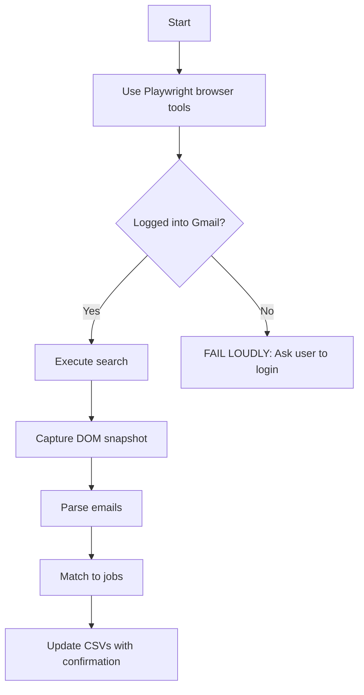
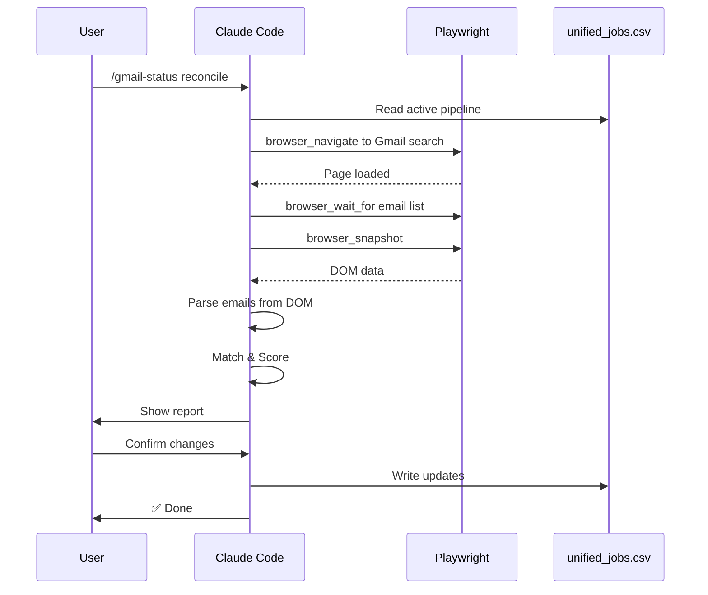

# /gmail-status

Gmail-integrated job application status with email sync.

## Usage

```
/gmail-status              # Full status with email scan
/gmail-status quick        # Quick check (no email scan)
/gmail-status sync         # Full sync with status updates
/gmail-status reconcile    # Cross-check Gmail vs tracker, fix mismatches
```

## CRITICAL: Gmail MCP Does NOT Work

**Gmail MCP has NEVER worked. It always returns ECONNREFUSED.**

**DO NOT attempt Gmail MCP tools.** Go straight to Playwright.

This skill uses **Playwright as PRIMARY** (not fallback). Do not waste time on MCP attempts.

### Primary Access Method: Playwright



### Error Handling

1. **On Playwright auth failure** → FAIL LOUDLY:
   ```
   ❌ Gmail not logged in.

   Please:
   1. Open Gmail in Chrome manually
   2. Ensure you're logged in
   3. Retry /gmail-status reconcile
   ```

2. **On ANY failure** → MUST include:
   - Explicit error message
   - What was attempted
   - What failed
   - Suggested next steps

3. **Success criteria for "no action needed"**:
   - Playwright connected successfully ✓
   - Email search executed ✓
   - Results processed ✓
   - Only THEN may report "no new emails" or "all up to date"

4. **MEDIUM confidence matches** → NEVER auto-update status
   - Always require user confirmation
   - Show match reasoning

## What This Skill Does

1. **Quick Mode** (`/gmail-status quick`):
   - Reads unified_jobs.csv for current pipeline
   - Categorizes by response tier (awaiting, follow-up, ghosted, archive)
   - No Gmail API calls - uses stored data only

2. **Standard Mode** (`/gmail-status`):
   - Runs quick check first
   - Searches Gmail for recent recruiter emails (last 14 days)
   - Highlights new emails needing attention
   - Shows unread count by tier

3. **Sync Mode** (`/gmail-status sync`):
   - Full Gmail search (last 90 days)
   - Matches emails to jobs in tracker
   - Updates unified_jobs.csv with:
     - `gmail_thread_id`
     - `last_email_date`
     - `recruiter_email`
   - Infers status changes from email content
   - Generates sync report

4. **Playwright Mode** (`/gmail-status --playwright`):
   - Uses browser automation when MCP unavailable
   - Opens Gmail in Playwright-controlled browser
   - Extracts emails via DOM parsing
   - Same matching logic as MCP mode

## Response Tiers

Based on research into recruiter response patterns:

| Days | Tier | Emoji | Action |
|------|------|-------|--------|
| 0-7 | Active | ✅ | On track |
| 8-13 | Awaiting Response | 🟡 | Monitor |
| 14-29 | Consider Follow-up | 🟠 | Send follow-up email |
| 30-44 | Likely Ghosted | 🔴 | Lower priority |
| 45+ | Archive Candidate | ⚫ | Move to closed/rejected |

## Gmail Search Queries Used

```
# Application confirmations
"application received" OR "thank you for applying"

# Recruiter outreach
from:recruiter OR from:talent OR from:careers

# Status updates
"next steps" OR "phone screen" OR "schedule"

# Rejections
"not moving forward" OR "other candidates"
```

## Playwright Tools (PRIMARY - Always Use These)

**DO NOT use Gmail MCP tools. They have never worked.**

Use these Playwright MCP tools:
- `mcp__plugin_playwright_playwright__browser_navigate` - Navigate to Gmail search
- `mcp__plugin_playwright_playwright__browser_wait_for` - Wait for email list to load
- `mcp__plugin_playwright_playwright__browser_snapshot` - Capture DOM for parsing
- `mcp__plugin_playwright_playwright__browser_click` - Click on email rows if needed

## Labels Created

The sync creates these Gmail labels for organization:
- `JobSearch/Applied` - Application confirmations
- `JobSearch/Interview` - Active interview processes
- `JobSearch/Rejected` - Closures (for record)
- `JobSearch/FollowUp` - Needs response from me

## Data Files Modified

| File | Changes |
|------|---------|
| `data/unified_jobs.csv` | Updates gmail_thread_id, last_email_date, recruiter_email, days_since_contact |
| `data/unified_jobs.csv (application columns)` | Updates email_summary, next_action, response_tier |
| `ACTIVE/JOB_STATUS.md` | Regenerated with response tiers |

## Implementation

The skill orchestrates these scripts:
- `scripts/gmail_quick_check.py` - Fast local analysis
- `scripts/gmail_sync.py` - Full sync logic (matching, status inference)
- `scripts/render_status.py` - Generate status report

## Example Output

### Success Case
```
📬 Job Application Status
==================================================

📊 Pipeline: 8 active applications
   1 need follow-up, 5 likely ghosted, 1 archive candidates

⚠️  Follow-up Recommended (1):
   🟠 Amazon: Sr Data Scientist Books Ads
      26 days waiting • Status: applied

📋 Response Tiers:
   ✅ Active (on track): 1
   🟠 Consider Follow-up (14-29d): 1
   🔴 Likely Ghosted (30-44d): 5
   ⚫ Archive Candidate (45+d): 1

📧 Gmail Status:
   ✅ MCP connected successfully
   New emails since last sync: 3
   Unread recruiter emails: 1

💡 Run '/gmail-status sync' for full email sync
```

### Failure Case (NEVER SILENT)
```
📬 Job Application Status
==================================================

❌ GMAIL SYNC FAILED

Error: Gmail not logged in (login page detected)
Attempted: Playwright browser_navigate to Gmail search
Status: Authentication required

⚠️ Please:
1. Open Gmail manually in Chrome
2. Log in to your account
3. Retry: /gmail-status reconcile

📊 Local Pipeline (cached data):
   8 active applications
   Data may be stale (last sync: 3 days ago)
```

## Confidence Level Handling

### HIGH Confidence (auto-update allowed)
- Exact company domain match
- Title matches >80%
- Applied within 7 days of email

### MEDIUM Confidence (requires confirmation)
```
🟡 MEDIUM confidence match found:
   Email: "Interview with Data Science Team"
   Matched to: Amazon - Sr Data Scientist
   Reason: Company domain match, title partial (65%)

   ❓ Update job status to "interview"?
   [Yes] [No] [Show more context]
```

### LOW Confidence (report only)
- Logged for manual review
- Never auto-updates

---

## Reconciliation Workflow (`/gmail-status reconcile`)

**Purpose**: Fix data integrity gaps where Gmail findings don't persist to tracker CSVs.

### When to Use
- Weekly maintenance (via `make gmail_reconcile`)
- After discovering status mismatches
- When `unified_jobs.csv` shows `status=new` but Gmail has correspondence

### Step 1: Load Active Pipeline

```python
# Read unified_jobs.csv
# Filter: status IN ('new', 'applied', 'interview')
# Group by company (unique list)
# Report: "Found X companies to check"
```

**Expected output**:
```
📋 Loading active pipeline...
   Found 15 companies to check:
   - Amazon (applied, last_email: 2026-01-28)
   - Netflix (applied, last_email: none)
   - Oscar Health (interview, last_email: 2026-01-23)
   ...
```

### Step 2: Search Gmail via Playwright (Batches of 5)

**DO NOT attempt Gmail MCP. It has never worked. Use Playwright directly.**

For each company batch:

1. **Navigate to Gmail search** (Playwright):
   ```
   Tool: mcp__plugin_playwright_playwright__browser_navigate
   URL: https://mail.google.com/mail/u/0/#search/from:{domain}+OR+subject:{company}+job
   Example: https://mail.google.com/mail/u/0/#search/from:amazon.jobs+OR+subject:Amazon+job
   ```

2. **Wait for email list**:
   ```
   Tool: mcp__plugin_playwright_playwright__browser_wait_for
   Selector: table[role='grid']  # Gmail email list container
   Timeout: 10000
   ```

3. **Capture DOM snapshot**:
   ```
   Tool: mcp__plugin_playwright_playwright__browser_snapshot
   ```

4. **Parse emails from snapshot** using these CSS selectors:
   - Email rows: `tr.zA` or `tr.zE` (unread)
   - Subject: `span.bog`
   - Sender: `span.zF`
   - Snippet: `span.y2`
   - Date: `td.xW span`

5. **Collect from each email**:
   - `thread_id` (from URL or data attribute)
   - `date` (parse "Jan 15" or "10:30 AM" format)
   - `from` (sender email)
   - `subject`
   - `snippet` (preview text)

6. **If auth required** → FAIL LOUDLY:
   ```
   ❌ Gmail not logged in.

   Please:
   1. Open Gmail in Chrome manually
   2. Ensure you're logged in
   3. Retry /gmail-status reconcile
   ```

### Step 3: Match & Score

For each email found, calculate confidence score:

| Signal | Score | Example |
|--------|-------|---------|
| Company domain exact match | +0.5 | `@amazon.jobs` → Amazon |
| Job title keywords in subject | +0.3 | "Data Scientist" in subject |
| Sender domain match | +0.2 | `noreply@company.com` |
| Recent date (within 60 days) | +0.1 | Email from last 2 months |

**Total score determines action**:
- **≥0.9**: Auto-apply (high confidence)
- **0.7-0.9**: Ask user for confirmation
- **0.5-0.7**: Ask user, show reasoning
- **<0.5**: Skip, flag for manual review

### Step 4: Infer Status from Content

Scan email subject + snippet for status signals:

| Pattern | Inferred Status | Confidence |
|---------|-----------------|------------|
| "unfortunately" / "other candidates" / "not moving forward" | `rejected` | HIGH |
| "interview" / "schedule" / "meet" / "call" | `interview` | MEDIUM |
| "received your application" / "thank you for applying" | `applied` | HIGH |
| "assessment" / "coding challenge" | `assessment` | MEDIUM |
| "offer" / "compensation" | `offer` | HIGH |

**MEDIUM confidence status changes ALWAYS require confirmation**:
```
🟡 MEDIUM confidence status inference:
   Email: "Let's schedule a time to chat about the role"
   Current status: applied
   Inferred status: interview

   ❓ Update status to "interview"?
   [Yes] [No] [Show full email]
```

### Step 5: Report Findings

Group by action needed:

```
═══════════════════════════════════════════════════════════════
GMAIL RECONCILIATION REPORT
═══════════════════════════════════════════════════════════════

✅ AUTO-APPLY (confidence ≥ 0.9): 3 matches
───────────────────────────────────────────────────────────────
1. Amazon (job_id: 6687120dbc2d)
   Email: "Your interview is scheduled for Jan 30"
   Action: Update gmail_thread_id, last_email_date
   Status: No change (already 'interview')

2. Coinbase (job_id: cb1a2b3c4d5e)
   Email: "We've decided to move forward with other candidates"
   Action: Update status 'applied' → 'rejected'
   + Update gmail_thread_id, last_email_date, recruiter_email

3. DoorDash (job_id: dd1a2b3c4d5e)
   Email: "Thank you for applying to Applied Scientist"
   Action: Confirm existing 'applied' status
   + Update gmail_thread_id, last_email_date

───────────────────────────────────────────────────────────────
🟡 NEEDS CONFIRMATION (confidence 0.7-0.9): 2 matches
───────────────────────────────────────────────────────────────
4. Gusto (job_id: gu3a4b5c6d7e)
   Email: "RE: Senior Data Scientist - 401(k)"
   Matched by: Domain (@gusto.com) + title keywords
   Confidence: 0.85

   ❓ Is this the same job? [Yes] [No] [Skip]

───────────────────────────────────────────────────────────────
⚠️ SKIPPED (confidence < 0.5): 5 emails
───────────────────────────────────────────────────────────────
- "Newsletter from TechCrunch" (no company match)
- "LinkedIn: Jobs you may be interested in" (aggregator)
...
```

### Step 6: Apply Changes (with confirmation)

**ALWAYS show diff before writing**:

```
📝 PROPOSED CHANGES
═══════════════════════════════════════════════════════════════

unified_jobs.csv (3 rows):
───────────────────────────────────────────────────────────────
Row 28 (cb1a2b3c4d5e - Coinbase):
  - status: applied → rejected
  + gmail_thread_id: 19c0a268eecc961c
  + last_email_date: 2026-01-29
  + recruiter_email: no-reply@coinbase.com

Row 29 (dd1a2b3c4d5e - DoorDash):
  + gmail_thread_id: 19c0b1234def5678
  + last_email_date: 2026-01-26

Row 30 (ab1a2b3c4d5e - Airbnb):
  + gmail_thread_id: 19c0c9876fed4321
  + last_email_date: 2026-01-26

unified_jobs.csv (application columns) (1 new row):
───────────────────────────────────────────────────────────────
+ cb1a2b3c4d5e,2025-12-16,...,rejected,2026-01-29,none,...

═══════════════════════════════════════════════════════════════
❓ Apply these changes?
   [Yes - Apply all] [Review one by one] [Abort]
```

**Require explicit "yes" to apply changes.**

### Tool Sequence (Playwright PRIMARY)

**Gmail MCP has NEVER worked. Do NOT attempt it. Use Playwright directly.**



### Playwright Workflow Details

**This is the PRIMARY (and only) method. Not a fallback.**

1. **Navigate to Gmail search**:
   ```
   Tool: mcp__plugin_playwright_playwright__browser_navigate
   URL: https://mail.google.com/mail/u/0/#search/{encoded_query}
   ```

2. **Wait for email list to load**:
   ```
   Tool: mcp__plugin_playwright_playwright__browser_wait_for
   Selector: table[role='grid']
   Timeout: 10000
   ```

3. **Capture DOM snapshot**:
   ```
   Tool: mcp__plugin_playwright_playwright__browser_snapshot
   ```

4. **Parse snapshot** using these CSS selectors:
   - Email rows: `tr.zA` (read) or `tr.zE` (unread)
   - Subject: `span.bog`
   - Sender: `span.zF`
   - Snippet: `span.y2`
   - Date: `td.xW span`

### Authentication

Playwright inherits the user's Chrome profile with Gmail session.

- **Happy path**: No login prompt needed
- **If logged out** → FAIL LOUDLY:
  ```
  ❌ Gmail not logged in in browser.

  Please:
  1. Open Gmail manually in Chrome
  2. Log in to your account
  3. Retry /gmail-status reconcile
  ```

**Do NOT attempt to automate login.** Gmail 2FA makes this unreliable.

### Error Recovery

| Error | Response | Next Step |
|-------|----------|-----------|
| Playwright auth required | FAIL LOUDLY | Ask user to login manually |
| Gmail page doesn't load | FAIL LOUDLY | Check internet, retry |
| Rate limited | Reduce batch size | Retry with 2-company batches |
| CSV write failure | Rollback | Show error, preserve original |
| Partial success | Report which succeeded | User decides next action |

**NEVER fail silently. NEVER say "no action needed" when sync failed.**

**DO NOT attempt Gmail MCP as "alternative". It has never worked.**

### Weekly Integration

This workflow is triggered by `make gmail_reconcile` as part of `make weekly`:

```bash
# Weekly maintenance now includes:
make weekly  # verify + freshness_audit + gmail_reconcile + follow_ups + analytics
```

### Data Files Modified

| File | Field Updates |
|------|---------------|
| `unified_jobs.csv` | `status`, `gmail_thread_id`, `last_email_date`, `recruiter_email` |
| `unified_jobs.csv (application columns)` | `status`, `last_touch`, `next_action`, `email_summary`, `response_tier` |

### Troubleshooting

**Q: Playwright shows login page instead of search results**
- Gmail session expired → Log in manually in Chrome, then retry
- Incognito mode → Playwright needs access to Chrome profile with active session

**Q: Playwright can't access Gmail**
- Ensure logged into Gmail in Chrome (the browser Playwright controls)
- If 2FA triggered → Complete login manually, then retry skill

**Q: Confidence scores seem wrong**
- Review `Step 3: Match & Score` criteria
- Company name variations (e.g., "Meta" vs "Facebook") may need manual mapping

**Q: Should I try Gmail MCP instead?**
- **NO.** Gmail MCP has NEVER worked (always ECONNREFUSED)
- Playwright is the only working method
- Do not waste time debugging MCP

**Q: DOM snapshot doesn't contain email data**
- Gmail may have changed CSS classes → Check current selectors manually
- Page may not have loaded → Increase wait_for timeout
- Search returned 0 results → Verify query syntax in Gmail web UI first
